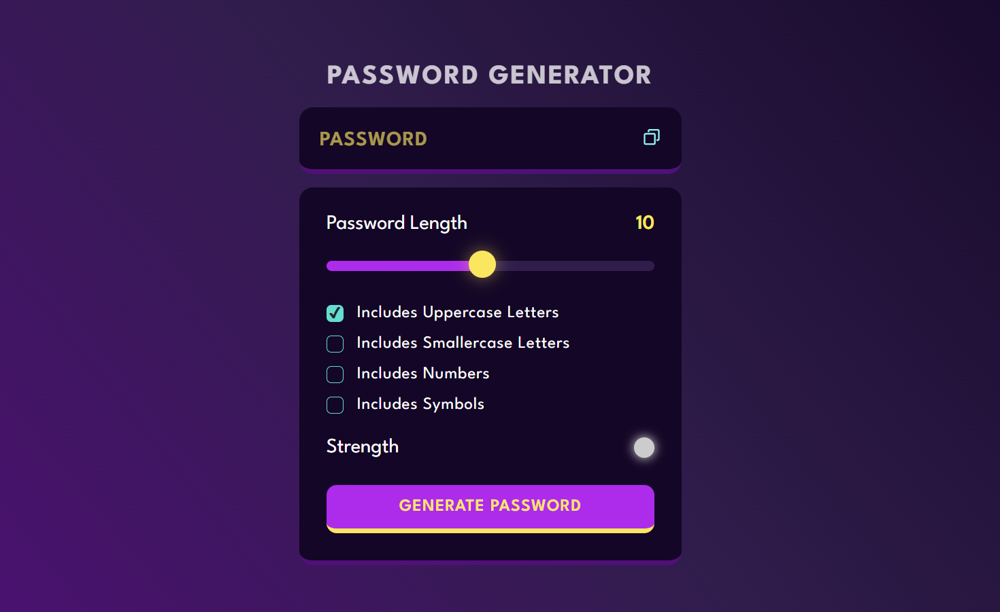

# 🔐 Password Generator

A sleek and functional **Password Generator** website built using **HTML**, **CSS**, and **JavaScript**. Easily generate secure, random passwords based on your selected preferences.

# Demo

You can view the live demo of the Weather App [here](https://password-generator-zeta-green.vercel.app/).

## 🚀 Features

- 🧠 Generate strong random passwords instantly
- 🔒 Include options for uppercase, lowercase, numbers, and symbols
- 🎛️ Adjustable password length
- 📋 Copy password to clipboard functionality
- 📱 Fully responsive and user-friendly interface

## 🛠️ Tech Stack

- HTML5
- CSS3
- JavaScript (Vanilla)

## 🖼️ Screenshots



## 📁 Project Structure

password-generator/
├── index.html
├── styles.css
├── script.js
└── assets/

## ⚙️ Setup Instructions

1. Clone this repository:

   ```bash
   git clone https://github.com/Amarsah15/Password-Generator.git
   cd password-generator

   ```

2. Open `index.html` in your web browser.

3. Customize the password settings and click "Generate Password" to create a new password.

✨ Author
Made with ❤️ by Amarnath Kumar - [GitHub](https://github.com/Amarsah15)
